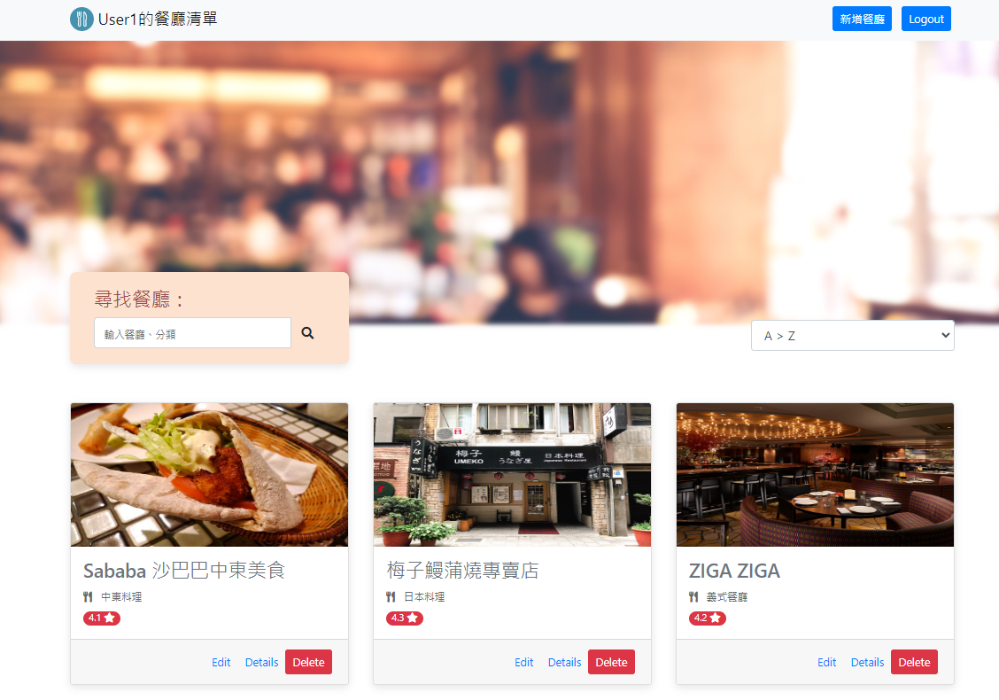

# 餐廳清單



## 介紹
簡易的餐廳清單，包含餐廳詳細資料和搜尋功能

### 功能
- 列出所有餐廳
- 點擊查看餐廳詳細資料
- 以餐廳名稱搜尋
- 新增餐廳功能
- 修改餐廳資料功能
- 刪除餐廳功能

## 開始使用

1. 請先安裝 node.js 與 npm
2. 將專案 clone 到本地
3. 在本地開啟之後，透過終端機進入資料夾，輸入：

   ```bash
   npm install
   ```

4. 安裝完畢後，輸入：

   ```bash
   npm run start
   ```

5. 看見此行訊息代表成功運行，可用瀏覽器進入到以下網址

   ```bash
   Listening on http://localhost:3000
   ```

6. 結束運行輸入

   ```bash
   ctrl + c
   ```

## 開發工具

- Node.js 14.16.0
- Express 4.16.4
- Express-Handlebars 3.0.0
- Bootstrap 4.3.1
- Mongoose 5.9.7
